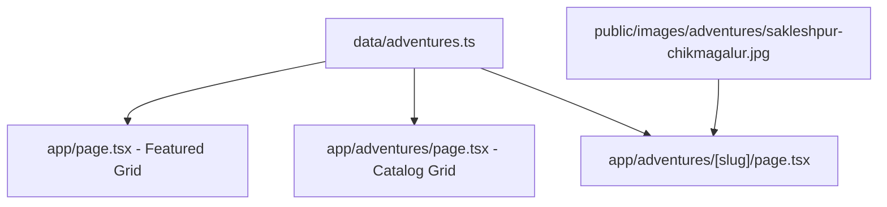

# Sakleshpur & Chikmagalur 3D2N Luxury Overland Expedition Implementation Plan

> **For agentic workers:** REQUIRED SUB-SKILL: Use superpowers:subagent-driven-development to implement this plan task-by-task. Steps use checkbox (`- [ ]`) syntax for tracking.

**Goal:** Add the new 3-Day / 2-Night Sakleshpur & Chikmagalur Western Ghats Luxury Overland Expedition (Oct 2 – Oct 4, 2026) to `data/adventures.ts` and verify page rendering & production build.

**Architecture:** Extend `adventures` array in `data/adventures.ts` with the new trip object. The Next.js App Router dynamic route (`app/adventures/[slug]/page.tsx`) will automatically pick up the new slug (`sakleshpur-chikmagalur-luxury-overland`) and render the detail page.

**Architecture Diagram:**



**Tech Stack:** Next.js 14 App Router, TypeScript, React, Tailwind CSS.

## Global Constraints
- Frame: Next.js 14 App Router
- Package Manager: pnpm
- Data source: `data/adventures.ts`
- Image location: `public/images/adventures/sakleshpur-chikmagalur.jpg`

---

### Task 1: Add Sakleshpur & Chikmagalur Adventure Entry

**Files:**
- Modify: `data/adventures.ts:295`

**Interfaces:**
- Consumes: `Adventure` interface definition from `data/adventures.ts:1-20`
- Produces: New `Adventure` record with slug `'sakleshpur-chikmagalur-luxury-overland'`

- [ ] **Step 1: Add new trip to `adventures` array in `data/adventures.ts`**

```typescript
  {
    id: '4',
    slug: 'sakleshpur-chikmagalur-luxury-overland',
    title: 'Sakleshpur & Chikmagalur Western Ghats Luxury Overland',
    description: 'A 3-Day / 2-Night luxury self-drive convoy through tea estates, misty peaks, and off-road trails of Sakleshpur & Chikmagalur with 4-star resort stays.',
    longDescription: 'Embark on a premium 3-Day / 2-Night Western Ghats overland expedition from Bangalore to Sakleshpur and Chikmagalur (Oct 2 – Oct 4, 2026). Drive your own 4x4 or AWD SUV behind our expert lead support vehicle, exploring private coffee plantations, mountain passes, and waterfalls, while unwinding each evening in handpicked 4-star luxury resorts.',
    duration: '3 Days / 2 Nights',
    difficulty: 'Moderate',
    price: '₹38,500',
    image: '/images/adventures/sakleshpur-chikmagalur.jpg',
    backgroundImage: 'https://images.unsplash.com/photo-1506744038136-46273834b3fb?q=80&w=2070',
    featured: true,
    highlights: [
      '4-Star Luxury Resort stays in Sakleshpur & Chikmagalur',
      'Self-drive convoy led by Plus530 professional 4x4 support team',
      'Private coffee & tea estate off-road trail drive',
      'Sunset drive to Mullayanagiri Peak (Karnataka\'s highest peak)',
      'Explore Baba Budangiri & estate waterfalls',
      'Walkie-talkie communication sets & full recovery support',
    ],
    included: [
      '2 Nights stay in 4-Star Luxury Resorts (Double Occupancy)',
      'All meals (Breakfasts, Highway & Estate Lunches, Gourmet Dinners)',
      'Plus530 Lead 4x4 Support Vehicle & Experienced Expedition Leader',
      'Off-road spotters & recovery equipment on standby',
      'Vehicle walkie-talkie radio setup for convoy communication',
      'All trail permits, estate access fees, and taxes',
    ],
    itinerary: [
      {
        day: 1,
        title: 'Bangalore to Sakleshpur: Highway Cruise & Estate Off-Road Trail',
        description: 'Convoy assembly in Bangalore at 6:00 AM. Scenic highway drive to Sakleshpur. Check-in at 4-star luxury estate resort. Afternoon off-road 4x4 trail through private coffee plantations and hidden stream crossings. Evening welcome dinner & briefing.',
      },
      {
        day: 2,
        title: 'Sakleshpur to Chikmagalur: Ghats Ridge Drive & Mullayanagiri Peak',
        description: 'Morning ridge road drive from Sakleshpur to Chikmagalur. Check-in at luxury hill resort. Afternoon ascent up Mullayanagiri Peak and Baba Budangiri. High-altitude tea tasting and estate dinner under the stars.',
      },
      {
        day: 3,
        title: 'Chikmagalur Coffee Trails & Return to Bangalore',
        description: 'Morning coffee estate walk and tea plantation trail. Farewell convoy lunch in Chikmagalur. Scenic return drive to Bangalore, arriving by 8:00 PM.',
      },
    ],
  },
```

- [ ] **Step 2: Verify `data/adventures.ts` TypeScript types**

Run: `pnpm build`
Expected: Build passes or progresses past type-check.

- [ ] **Step 3: Commit changes**

```bash
git add data/adventures.ts public/images/adventures/sakleshpur-chikmagalur.jpg docs/
git commit -m "feat: add Sakleshpur & Chikmagalur 3D2N luxury overland expedition"
```

---

### Task 2: Build & Route Verification

**Files:**
- Verify: `http://localhost:3000/adventures/sakleshpur-chikmagalur-luxury-overland`

- [ ] **Step 1: Check production build**

Run: `pnpm build`
Expected: `✓ Creating an optimized production build` with 0 errors.

- [ ] **Step 2: Commit final status**

```bash
git add .
git commit -m "chore: verify production build for Sakleshpur & Chikmagalur trip"
```
