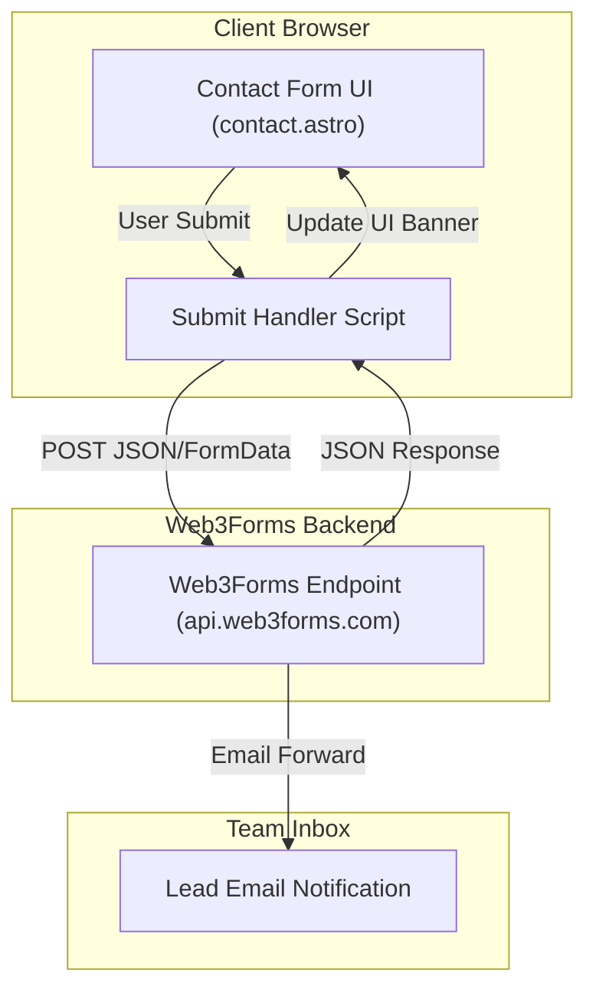

# Web3Forms Lead Collection Implementation Plan

> **For agentic workers:** REQUIRED SUB-SKILL: Use superpowers:subagent-driven-development to implement this plan task-by-task. Steps use checkbox (`- [ ]`) syntax for tracking.

**Goal:** Integrate Web3Forms submission on the Plus530 Adventure contact page to send lead inquiries directly to the team's email inbox with full visual feedback, honeypot anti-spam protection, and environment variable configuration.

**Architecture:** The client-side Astro script intercepts form submission on `src/pages/contact.astro`, formats a `FormData` payload including a hidden honeypot field, posts it directly to Web3Forms API endpoint, and displays dynamic UI states (loading, success, error).

**Architecture Diagram:**



**Tech Stack:** Astro 4, TypeScript, Tailwind CSS, Web3Forms API.

## Global Constraints
- Target Page: `src/pages/contact.astro`
- Deploy Target: Static SSG (Cloudflare Pages)
- Package Manager: `pnpm`
- Environment Variable Key: `PUBLIC_WEB3FORMS_ACCESS_KEY`

---

### Task 1: Environment & Contact Form Web3Forms Integration

**Files:**
- Create: `.env.example`
- Modify: `src/pages/contact.astro`

**Interfaces:**
- Consumes: `import.meta.env.PUBLIC_WEB3FORMS_ACCESS_KEY`
- Produces: Web3Forms contact form submission handler with honeypot field & feedback banner.

- [ ] **Step 1: Create `.env.example` file**

Create [file](file:///Volumes/NarayanAPFS/Projects/plus530adventure/.env.example) to document expected environment variable:
```env
PUBLIC_WEB3FORMS_ACCESS_KEY=your_web3forms_access_key_here
```

- [ ] **Step 2: Add Honeypot field and ID attributes to `src/pages/contact.astro`**

Update the contact form in [contact.astro](file:///Volumes/NarayanAPFS/Projects/plus530adventure/src/pages/contact.astro#L67-L110):

```diff
-            <form class="space-y-6" onsubmit="event.preventDefault(); alert('Thank you! We will get back to you shortly.');">
+            <form id="contact-form" class="space-y-6">
+              <input type="hidden" name="access_key" value={import.meta.env.PUBLIC_WEB3FORMS_ACCESS_KEY || "YOUR_ACCESS_KEY_HERE"} />
+              <input type="checkbox" name="botcheck" class="hidden" style="display: none;" />
+              
+              <div id="form-alert" class="hidden p-4 rounded-lg text-sm font-medium"></div>
+
               <div>
                 <label class="block text-sm font-medium text-gray-700 mb-2">Full Name</label>
                 <input
                   type="text"
+                  name="name"
                   required
                   class="w-full px-4 py-3 border border-gray-300 rounded-lg focus:ring-2 focus:ring-orange-500 focus:border-orange-500"
                   placeholder="Your Name"
                 />
               </div>

               <div>
                 <label class="block text-sm font-medium text-gray-700 mb-2">Email Address</label>
                 <input
                   type="email"
+                  name="email"
                   required
                   class="w-full px-4 py-3 border border-gray-300 rounded-lg focus:ring-2 focus:ring-orange-500 focus:border-orange-500"
                   placeholder="you@example.com"
                 />
               </div>

               <div>
                 <label class="block text-sm font-medium text-gray-700 mb-2">Phone Number</label>
                 <input
                   type="tel"
+                  name="phone"
                   class="w-full px-4 py-3 border border-gray-300 rounded-lg focus:ring-2 focus:ring-orange-500 focus:border-orange-500"
                   placeholder="+91 98765 43210"
                 />
               </div>

               <div>
                 <label class="block text-sm font-medium text-gray-700 mb-2">Message</label>
                 <textarea
+                  name="message"
                   rows="4"
                   required
                   class="w-full px-4 py-3 border border-gray-300 rounded-lg focus:ring-2 focus:ring-orange-500 focus:border-orange-500"
                   placeholder="Tell us which adventure you are interested in..."
                 ></textarea>
               </div>

-              <Button type="submit" className="w-full">
-                Send Message <Send class="ml-2 h-4 w-4 inline-block" />
-              </Button>
+              <button
+                type="submit"
+                id="submit-btn"
+                class="w-full bg-orange-600 hover:bg-orange-700 text-white font-semibold py-3 px-6 rounded-lg transition-colors flex items-center justify-center space-x-2 disabled:opacity-50"
+              >
+                <span id="btn-text">Send Message</span>
+                <svg id="btn-icon" class="w-4 h-4 ml-2 inline-block" fill="none" stroke="currentColor" viewBox="0 0 24 24">
+                  <path stroke-linecap="round" stroke-linejoin="round" stroke-width="2" d="M14 5l7 7m0 0l-7 7m7-7H3" />
+                </svg>
+              </button>
             </form>
```

- [ ] **Step 3: Add client-side submit handler script to `src/pages/contact.astro`**

Append `<script>` tag at the bottom of [contact.astro](file:///Volumes/NarayanAPFS/Projects/plus530adventure/src/pages/contact.astro):

```html
<script>
  const form = document.getElementById('contact-form') as HTMLFormElement;
  const alertBox = document.getElementById('form-alert') as HTMLDivElement;
  const submitBtn = document.getElementById('submit-btn') as HTMLButtonElement;
  const btnText = document.getElementById('btn-text') as HTMLSpanElement;

  if (form) {
    form.addEventListener('submit', async (e) => {
      e.preventDefault();
      
      alertBox.classList.add('hidden');
      alertBox.className = 'hidden p-4 rounded-lg text-sm font-medium';
      
      submitBtn.disabled = true;
      btnText.textContent = 'Sending message...';

      try {
        const formData = new FormData(form);
        const response = await fetch('https://api.web3forms.com/submit', {
          method: 'POST',
          body: formData,
        });

        const data = await response.json();

        if (response.status === 200 && data.success) {
          alertBox.textContent = 'Thank you! Your message has been sent successfully. We will get back to you shortly.';
          alertBox.className = 'p-4 rounded-lg text-sm font-medium bg-green-100 text-green-800 mb-6';
          alertBox.classList.remove('hidden');
          form.reset();
        } else {
          throw new Error(data.message || 'Submission failed');
        }
      } catch (error) {
        alertBox.textContent = 'Oops! Something went wrong while sending your message. Please try again or email us directly at info@plus530adventure.com.';
        alertBox.className = 'p-4 rounded-lg text-sm font-medium bg-red-100 text-red-800 mb-6';
        alertBox.classList.remove('hidden');
      } finally {
        submitBtn.disabled = false;
        btnText.textContent = 'Send Message';
      }
    });
  }
</script>
```

- [ ] **Step 4: Verify static build passes clean**

Run: `pnpm build`
Expected: `✓ Completed in ...` static build without any TypeScript or Astro errors.

- [ ] **Step 5: Commit changes**

```bash
git add .env.example src/pages/contact.astro
git commit -m "feat: integrate Web3Forms contact form submit handler and alert feedback"
```
