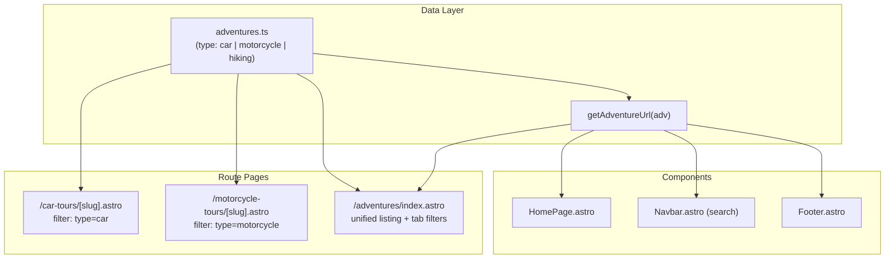

# Motorcycle Tours & Multi-Type Adventure System — Implementation Plan

> **For agentic workers:** REQUIRED SUB-SKILL: Use superpowers:subagent-driven-development to implement this plan task-by-task. Steps use checkbox (`- [ ]`) syntax for tracking.

**Goal:** Transform Plus530 Adventure from a car-only site into a multi-type adventure platform with Car Convoy and Motorcycle Tours, separate detail page routes per type, and a unified `/adventures` listing with client-side tab filters.

**Architecture:** A single `adventures.ts` data file with a `type` discriminator (`'car' | 'motorcycle' | 'hiking'`). Helper functions (`getAdventureUrl`, `getRoutePrefix`, `getTypeLabel`) centralize route generation. Separate Astro route directories (`/car-tours/[slug]`, `/motorcycle-tours/[slug]`) each filter by type in `getStaticPaths()`. The `/adventures` listing page adds a client-side tab filter bar with `data-type` attributes on cards.

**Architecture Diagram:**



**Tech Stack:** Astro 4, TypeScript, Tailwind CSS.

## Global Constraints
- Package Manager: `pnpm`
- Deploy Target: Cloudflare Pages (Static SSG)
- All route changes must use `getAdventureUrl()` helper — no hardcoded `/adventures/<slug>` patterns
- Existing 9 car adventures get `type: 'car'`
- 2 sample motorcycle tours added for end-to-end testing

---

### Task 1: Data Model — Add Type Field, Helpers, and Sample Motorcycle Tours

**Files:**
- Modify: `src/data/adventures.ts`

**Interfaces:**
- Produces: `AdventureType` type, `type` field on `Adventure`, `getRoutePrefix()`, `getAdventureUrl()`, `getTypeLabel()`, 2 sample motorcycle adventures.

- [ ] **Step 1: Add `AdventureType` type and `type` field to `Adventure` interface**

In [src/data/adventures.ts](file:///Volumes/NarayanAPFS/Projects/plus530adventure/src/data/adventures.ts), add:

```diff
+export type AdventureType = 'car' | 'motorcycle' | 'hiking';
+
 export interface Adventure {
   id: string;
   slug: string;
   title: string;
+  type: AdventureType;
   description: string;
```

- [ ] **Step 2: Add helper functions after the `Adventure` interface**

```typescript
export function getRoutePrefix(type: AdventureType): string {
  switch (type) {
    case 'car': return '/car-tours';
    case 'motorcycle': return '/motorcycle-tours';
    case 'hiking': return '/hiking';
  }
}

export function getAdventureUrl(adventure: Adventure): string {
  return `${getRoutePrefix(adventure.type)}/${adventure.slug}`;
}

export function getTypeLabel(type: AdventureType): string {
  switch (type) {
    case 'car': return 'Car Convoy';
    case 'motorcycle': return 'Motorcycle Tour';
    case 'hiking': return 'Hiking';
  }
}

export function getTypeEmoji(type: AdventureType): string {
  switch (type) {
    case 'car': return '🚗';
    case 'motorcycle': return '🏍️';
    case 'hiking': return '🥾';
  }
}
```

- [ ] **Step 3: Add `type: 'car'` to all 9 existing adventure entries**

Add `type: 'car',` after the `slug` field in each of the 9 existing adventure objects.

- [ ] **Step 4: Add 2 sample motorcycle tour entries**

Append to the `adventures` array:

```typescript
{
  id: '10',
  slug: 'ladakh-motorcycle-expedition',
  title: 'Ladakh Motorcycle Expedition',
  type: 'motorcycle',
  description: 'Ride through the world\'s highest motorable passes on two wheels across the stunning Ladakh region.',
  longDescription: 'Experience the raw thrill of riding through Ladakh on a powerful motorcycle. This 12-day expedition takes you across Khardung La, Chang La, and through the mesmerizing Nubra and Pangong landscapes. Ride alongside fellow bikers in a supported convoy with chase vehicle, mechanic, and medical support.',
  duration: '12 Days',
  difficulty: 'Challenging',
  price: '₹1,35,000',
  image: '/images/adventures/ladakh-card.jpg',
  backgroundImage: '/images/adventures/ladakh-1.jpg',
  nextBatchDates: ['01st Sep 2026', '20th Sep 2026'],
  featured: true,
  highlights: [
    'Ride over Khardung La (18,380 ft) and Chang La passes',
    'Motorcycle convoy with chase vehicle and mechanic support',
    'Camp under stars at Pangong Tso lakeside',
    'Ride through Nubra Valley sand dunes',
    'Experience Tibetan Buddhist culture in ancient monasteries',
    'Professional riding briefing and safety gear provided',
  ],
  included: [
    'Royal Enfield Himalayan 450 motorcycle (or equivalent)',
    'Fuel for entire expedition',
    'Chase vehicle with mechanic and spare parts',
    'Hotel and camping accommodations',
    'All meals during the expedition',
    'Inner line permits and medical oxygen kit',
  ],
  itinerary: [
    { day: 1, title: 'Arrival in Leh & Bike Handover', description: 'Arrive in Leh, rest for acclimatization. Evening bike handover, safety briefing, and gear check.' },
    { day: 2, title: 'Leh Acclimatization Ride', description: 'Short acclimatization ride to Shanti Stupa and Magnetic Hill. Bike familiarization.' },
    { day: 3, title: 'Leh to Nubra Valley via Khardung La', description: 'Ride over Khardung La (18,380 ft) into Nubra Valley. Visit Diskit Monastery.' },
    { day: 4, title: 'Nubra Valley Exploration', description: 'Ride through sand dunes, visit hot springs at Panamik. Chase vehicle support on standby.' },
    { day: 5, title: 'Nubra to Pangong via Shyok Route', description: 'Epic riding day through Shyok Valley to the stunning Pangong Tso lake.' },
    { day: 6, title: 'Pangong Lake Rest Day', description: 'Full day at Pangong Lake. Bike maintenance and photography.' },
    { day: 7, title: 'Pangong to Leh via Chang La', description: 'Return ride crossing Chang La pass. Visit Hemis Monastery en route.' },
    { day: 8, title: 'Leh to Tso Moriri', description: 'Long ride to the remote Tso Moriri lake through Chumathang.' },
    { day: 9, title: 'Tso Moriri to Sarchu', description: 'Ride through high-altitude plains to Sarchu campsite.' },
    { day: 10, title: 'Sarchu to Manali via Rohtang', description: 'Ride through Baralacha La and cross Rohtang Pass into Manali.' },
    { day: 11, title: 'Manali Rest Day', description: 'Rest day in Manali. Optional activities, bike return, farewell dinner.' },
    { day: 12, title: 'Departure from Manali', description: 'Transfer to airport or continue onward journey.' },
  ],
},
{
  id: '11',
  slug: 'rajasthan-royal-motorcycle-tour',
  title: 'Rajasthan Royal Motorcycle Tour',
  type: 'motorcycle',
  description: 'Ride through the royal desert state of Rajasthan — historic forts, vibrant bazaars, and golden sand dunes on two wheels.',
  longDescription: 'Cruise through Rajasthan on a motorcycle convoy, exploring majestic forts of Jaipur, Jodhpur, and Jaisalmer, and riding across the Thar Desert to Sam Sand Dunes. This 8-day tour combines heritage palace stays with thrilling desert riding, supported by a chase vehicle and experienced ride captain.',
  duration: '8 Days',
  difficulty: 'Moderate',
  price: '₹78,000',
  image: '/images/adventures/rajasthan-card.jpg',
  backgroundImage: '/images/adventures/rajasthan-hero.jpg',
  nextBatchDates: ['01st Dec 2026', '15th Jan 2027'],
  featured: false,
  highlights: [
    'Ride through Jaipur, Jodhpur, and Jaisalmer historic fort cities',
    'Desert riding to Sam Sand Dunes with chase vehicle support',
    'Heritage palace and haveli accommodation',
    'Sunset desert ride and overnight glamping under the stars',
    'Professional ride captain leading the convoy',
    'Royal Rajasthani cuisine and cultural experiences',
  ],
  included: [
    'Royal Enfield Classic 350 motorcycle (or equivalent)',
    'Fuel for entire tour',
    'Chase vehicle with mechanic and luggage carrier',
    'Heritage hotel and desert glamping accommodations',
    'All breakfasts and select meals',
    'Fort entrance fees and desert safari permits',
  ],
  itinerary: [
    { day: 1, title: 'Jaipur Assembly & Bike Handover', description: 'Arrive in Jaipur, bike handover, safety briefing, and welcome dinner at heritage haveli.' },
    { day: 2, title: 'Jaipur to Pushkar', description: 'Ride through Ajmer hills to the sacred lakeside town of Pushkar.' },
    { day: 3, title: 'Pushkar to Jodhpur', description: 'Scenic ride across Aravalli foothills to the Blue City. Evening Mehrangarh Fort visit.' },
    { day: 4, title: 'Jodhpur to Jaisalmer', description: 'Long desert ride across the Thar to the Golden City of Jaisalmer.' },
    { day: 5, title: 'Jaisalmer Fort & Sam Sand Dunes Ride', description: 'Morning fort exploration. Afternoon convoy ride to Sam Sand Dunes for desert glamping.' },
    { day: 6, title: 'Jaisalmer to Bikaner', description: 'Desert highway ride to Bikaner, visit Junagarh Fort.' },
    { day: 7, title: 'Bikaner to Mandawa (Shekhawati)', description: 'Ride to the painted haveli region of Shekhawati. Farewell group dinner.' },
    { day: 8, title: 'Mandawa to Jaipur Return', description: 'Final ride back to Jaipur. Bike return and expedition flag-in.' },
  ],
},
```

- [ ] **Step 5: Verify build passes**

Run: `pnpm build`
Expected: PASS (type field is added but not yet consumed by pages — existing pages still work)

- [ ] **Step 6: Commit**

```bash
git add src/data/adventures.ts
git commit -m "feat: add adventure type field, route helpers, and sample motorcycle tours"
```

---

### Task 2: Create Car Tours Route & Remove Old Adventures Detail Route

**Files:**
- Create: `src/pages/car-tours/[slug].astro` (copy from `src/pages/adventures/[slug].astro`)
- Delete: `src/pages/adventures/[slug].astro`

**Interfaces:**
- Consumes: `adventures` filtered by `type === 'car'`, `getAdventureUrl()` from `src/data/adventures.ts`

> [!IMPORTANT]
> The `src/pages/adventures/[slug].astro` file must be deleted after the car-tours version is created, otherwise Astro will generate conflicting static paths for any slug that exists in both.

- [ ] **Step 1: Copy `src/pages/adventures/[slug].astro` to `src/pages/car-tours/[slug].astro`**

```bash
mkdir -p src/pages/car-tours
cp src/pages/adventures/\[slug\].astro src/pages/car-tours/\[slug\].astro
```

- [ ] **Step 2: Update `src/pages/car-tours/[slug].astro`**

Update imports and `getStaticPaths` to filter by `type === 'car'`, import `getAdventureUrl`, and update the "Book Now" links to use `getAdventureUrl` for the contact page query params:

```diff
-import { adventures } from '../../data/adventures';
+import { adventures, getAdventureUrl } from '../../data/adventures';
```

```diff
 export async function getStaticPaths() {
-  return adventures.map((adventure) => ({
+  return adventures.filter(a => a.type === 'car').map((adventure) => ({
     params: { slug: adventure.slug },
     props: { adventure },
   }));
 }
```

Update the "Back to Adventures" link:
```diff
-        <a href="/adventures" class="inline-flex items-center text-white hover:text-orange-400 mb-6 transition-colors font-medium">
+        <a href="/adventures" class="inline-flex items-center text-white hover:text-orange-400 mb-6 transition-colors font-medium">
```
(This stays as `/adventures` — the unified listing page)

Update "Book Now" button hrefs (both the sticky bar and bottom CTA) to use `getAdventureUrl`:
```diff
-            <a href={`/contact?adventure=${adventure.slug}${upcomingBatchDates.length > 0 ? `&batch=${encodeURIComponent(upcomingBatchDates[0])}` : ''}`}>
+            <a href={`/contact?adventure=${adventure.slug}${upcomingBatchDates.length > 0 ? `&batch=${encodeURIComponent(upcomingBatchDates[0])}` : ''}`}>
```
(Book Now links stay the same — they pass slug to contact, not the detail page route)

Update the "View More Adventures" bottom CTA link to point to `/adventures`.

- [ ] **Step 3: Delete `src/pages/adventures/[slug].astro`**

```bash
rm src/pages/adventures/\[slug\].astro
```

- [ ] **Step 4: Verify build passes**

Run: `pnpm build`
Expected: Car tour pages now render at `/car-tours/<slug>`. No more `/adventures/<slug>` detail pages generated.

- [ ] **Step 5: Commit**

```bash
git add src/pages/car-tours/ && git rm src/pages/adventures/\[slug\].astro
git commit -m "feat: move car adventure detail pages to /car-tours/[slug] route"
```

---

### Task 3: Create Motorcycle Tours Route

**Files:**
- Create: `src/pages/motorcycle-tours/[slug].astro` (based on `src/pages/car-tours/[slug].astro`)

**Interfaces:**
- Consumes: `adventures` filtered by `type === 'motorcycle'`, `getAdventureUrl()`.

- [ ] **Step 1: Copy car-tours page as base**

```bash
mkdir -p src/pages/motorcycle-tours
cp src/pages/car-tours/\[slug\].astro src/pages/motorcycle-tours/\[slug\].astro
```

- [ ] **Step 2: Update `getStaticPaths` filter in `src/pages/motorcycle-tours/[slug].astro`**

```diff
-  return adventures.filter(a => a.type === 'car').map((adventure) => ({
+  return adventures.filter(a => a.type === 'motorcycle').map((adventure) => ({
```

- [ ] **Step 3: Verify build passes**

Run: `pnpm build`
Expected: Motorcycle tour pages render at `/motorcycle-tours/ladakh-motorcycle-expedition` and `/motorcycle-tours/rajasthan-royal-motorcycle-tour`.

- [ ] **Step 4: Commit**

```bash
git add src/pages/motorcycle-tours/
git commit -m "feat: add motorcycle-tours detail page route"
```

---

### Task 4: Adventures Listing Page — Tab Filters & Type Badges

**Files:**
- Modify: `src/pages/adventures/index.astro`

**Interfaces:**
- Consumes: `adventures`, `getAdventureUrl()`, `getTypeLabel()`, `getTypeEmoji()` from `src/data/adventures.ts`

- [ ] **Step 1: Update imports in `src/pages/adventures/index.astro`**

```diff
-import { adventures } from '../../data/adventures';
+import { adventures, getAdventureUrl, getTypeLabel, getTypeEmoji } from '../../data/adventures';
```

- [ ] **Step 2: Update page header text**

```diff
-        <h1 class="text-4xl md:text-5xl font-bold mb-4">Our Expeditions</h1>
-        <p class="text-xl text-gray-300 max-w-2xl mx-auto">
-          Explore self-drive 4x4 convoys and luxury overland journeys
-        </p>
+        <h1 class="text-4xl md:text-5xl font-bold mb-4">Our Adventures</h1>
+        <p class="text-xl text-gray-300 max-w-2xl mx-auto">
+          Explore car convoys, motorcycle tours, and epic overland journeys
+        </p>
```

- [ ] **Step 3: Add tab filter bar above grid**

Add between the header section and the catalog grid section:

```html
        <div class="flex flex-wrap gap-3 mb-10 justify-center" id="filter-tabs">
          <button data-filter="all" class="filter-tab px-5 py-2.5 rounded-full text-sm font-bold transition-all duration-200 bg-orange-600 text-white">
            All
          </button>
          <button data-filter="car" class="filter-tab px-5 py-2.5 rounded-full text-sm font-bold transition-all duration-200 bg-gray-100 text-gray-700 hover:bg-gray-200">
            🚗 Car Convoy
          </button>
          <button data-filter="motorcycle" class="filter-tab px-5 py-2.5 rounded-full text-sm font-bold transition-all duration-200 bg-gray-100 text-gray-700 hover:bg-gray-200">
            🏍️ Motorcycle Tours
          </button>
        </div>
```

- [ ] **Step 4: Add `data-type` attribute and type badge to adventure cards**

Update card link to use `getAdventureUrl()` and add `data-type`:

```diff
-              <a href={`/adventures/${adventure.slug}`}>
+              <a href={getAdventureUrl(adventure)} data-type={adventure.type}>
```

Add type badge inside the card image overlay area (after the Featured badge):

```html
                    <div class="absolute top-4 left-4 flex gap-2">
                      {adventure.featured && (
                        <span class="bg-green-600 text-white px-3 py-1 rounded-full text-sm font-semibold">
                          Featured
                        </span>
                      )}
                      <span class="bg-white/90 backdrop-blur-sm text-gray-800 px-3 py-1 rounded-full text-xs font-bold">
                        {getTypeEmoji(adventure.type)} {getTypeLabel(adventure.type)}
                      </span>
                    </div>
```

(Remove the old standalone Featured badge `div` on line 40-43)

- [ ] **Step 5: Add client-side filter script**

```html
<script>
  const filterTabs = document.querySelectorAll('.filter-tab');
  const adventureCards = document.querySelectorAll('[data-type]');

  filterTabs.forEach((tab) => {
    tab.addEventListener('click', () => {
      const filter = tab.getAttribute('data-filter');

      filterTabs.forEach((t) => {
        t.classList.remove('bg-orange-600', 'text-white');
        t.classList.add('bg-gray-100', 'text-gray-700', 'hover:bg-gray-200');
      });
      tab.classList.remove('bg-gray-100', 'text-gray-700', 'hover:bg-gray-200');
      tab.classList.add('bg-orange-600', 'text-white');

      adventureCards.forEach((card) => {
        const cardType = card.getAttribute('data-type');
        if (filter === 'all' || cardType === filter) {
          (card as HTMLElement).style.display = '';
        } else {
          (card as HTMLElement).style.display = 'none';
        }
      });
    });
  });
</script>
```

- [ ] **Step 6: Verify build passes**

Run: `pnpm build`
Expected: PASS

- [ ] **Step 7: Commit**

```bash
git add src/pages/adventures/index.astro
git commit -m "feat: add tab filters and type badges to adventures listing page"
```

---

### Task 5: Update All Internal Links Across Components, Blog, and Contact

**Files:**
- Modify: `src/components/HomePage.astro`
- Modify: `src/components/Navbar.astro`
- Modify: `src/components/Footer.astro`
- Modify: `src/content/blog/bhutan-next-adventure.md`
- Modify: `src/pages/contact.astro`

**Interfaces:**
- Consumes: `getAdventureUrl()` from `src/data/adventures.ts`

- [ ] **Step 1: Update `src/components/HomePage.astro`**

Import `getAdventureUrl`:
```diff
-import { getFeaturedAdventures } from '../data/adventures';
+import { getFeaturedAdventures, getAdventureUrl } from '../data/adventures';
```

Update Bhutan banner link (line 24):
```diff
-    <a href="/adventures/bhutan-overland" class="absolute inset-0 z-20" aria-label="View Bhutan adventure"></a>
+    <a href="/car-tours/bhutan-overland" class="absolute inset-0 z-20" aria-label="View Bhutan adventure"></a>
```

Update featured adventure card links (line 94):
```diff
-            <a href={`/adventures/${adventure.slug}`}>
+            <a href={getAdventureUrl(adventure)}>
```

- [ ] **Step 2: Update `src/components/Navbar.astro`**

Import `getAdventureUrl`:
```diff
-import { adventures } from '../data/adventures';
+import { adventures, getAdventureUrl } from '../data/adventures';
```

Add `type` to `searchDataJson` (line 16-26):
```diff
 const searchDataJson = JSON.stringify(
   adventures.map(a => ({
     title: a.title,
     slug: a.slug,
+    type: a.type,
     description: a.description,
     duration: a.duration,
     price: a.price,
     image: a.image,
     highlights: a.highlights.join(' ')
   }))
 );
```

Update the `AdventureItem` interface in the client script (line 173-181):
```diff
   interface AdventureItem {
     title: string;
     slug: string;
+    type: string;
     description: string;
     duration: string;
     price: string;
     image: string;
     highlights: string;
   }
```

Add a client-side route prefix function and update search result link generation (line 248):
```diff
+    function getRoutePrefixClient(type: string): string {
+      switch (type) {
+        case 'car': return '/car-tours';
+        case 'motorcycle': return '/motorcycle-tours';
+        case 'hiking': return '/hiking';
+        default: return '/adventures';
+      }
+    }
+
           (item) => `
           <a
-            href="/adventures/${item.slug}"
+            href="${getRoutePrefixClient(item.type)}/${item.slug}"
             class="flex items-center space-x-3 p-3 hover:bg-orange-50 transition-colors duration-150 group"
           >
```

- [ ] **Step 3: Update `src/components/Footer.astro`**

Update hardcoded expedition links (lines 80, 83, 86, 89):
```diff
-            <a href="/adventures/bhutan-overland" ...>Bhutan Overland</a>
+            <a href="/car-tours/bhutan-overland" ...>Bhutan Overland</a>
```
```diff
-            <a href="/adventures/nepal-himalayan-trail" ...>Nepal Trail</a>
+            <a href="/car-tours/nepal-himalayan-trail" ...>Nepal Trail</a>
```
```diff
-            <a href="/adventures/ladakh-expedition" ...>Ladakh Expedition</a>
+            <a href="/car-tours/ladakh-expedition" ...>Ladakh Expedition</a>
```
```diff
-            <a href="/adventures/sakleshpur-chikmagalur-luxury-overland" ...>Sakleshpur & Chikmagalur</a>
+            <a href="/car-tours/sakleshpur-chikmagalur-luxury-overland" ...>Sakleshpur & Chikmagalur</a>
```

- [ ] **Step 4: Update blog post markdown**

In [src/content/blog/bhutan-next-adventure.md](file:///Volumes/NarayanAPFS/Projects/plus530adventure/src/content/blog/bhutan-next-adventure.md) (line 124):
```diff
-[Check out our Bhutan Overland Adventure](/adventures/bhutan-overland)
+[Check out our Bhutan Overland Adventure](/car-tours/bhutan-overland)
```

- [ ] **Step 5: Update `src/pages/contact.astro` adventure dropdown**

Import `getAdventureUrl` and `getTypeLabel`:
```diff
-import { adventures } from '../data/adventures';
+import { adventures, getAdventureUrl, getTypeLabel } from '../data/adventures';
```

Update the adventure select options to show the type label:
```diff
                  {adventures.map((adv) => (
-                    <option value={adv.slug} data-batches={JSON.stringify(getUpcomingBatchDates(adv.nextBatchDates))}>
-                      {adv.title}
+                    <option value={adv.slug} data-batches={JSON.stringify(getUpcomingBatchDates(adv.nextBatchDates))}>
+                      [{getTypeLabel(adv.type)}] {adv.title}
                     </option>
                  ))}
```

- [ ] **Step 6: Verify full build passes**

Run: `pnpm build`
Expected: All 38+ pages build cleanly with no broken references.

- [ ] **Step 7: Commit**

```bash
git add src/components/HomePage.astro src/components/Navbar.astro src/components/Footer.astro src/content/blog/bhutan-next-adventure.md src/pages/contact.astro
git commit -m "feat: update all internal links to type-aware adventure routes"
```
