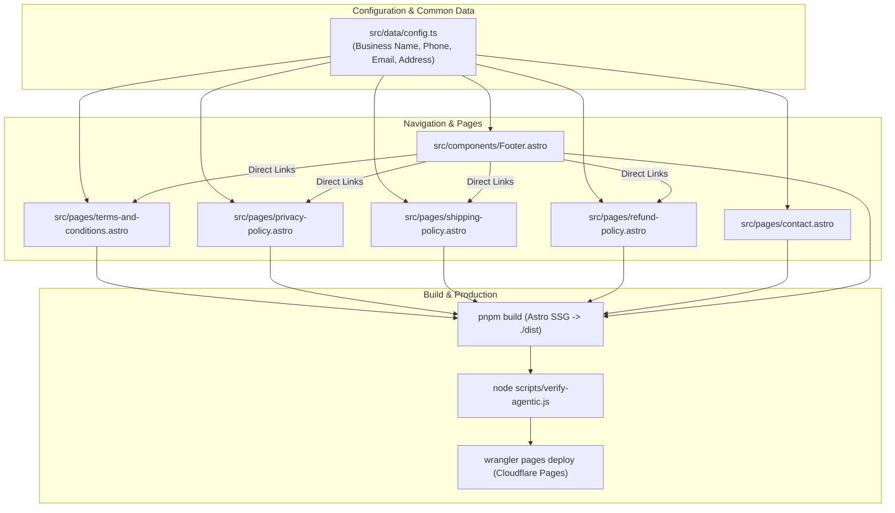

# Cashfree Payment Gateway Compliance & Legal Policy Pages Implementation Plan

> **For agentic workers:** REQUIRED SUB-SKILL: Use superpowers:subagent-driven-development to implement this plan task-by-task. Steps use checkbox (`- [ ]`) syntax for tracking.

**Goal:** Create mandatory legal policy pages (Terms & Conditions, Privacy Policy, Shipping/Delivery Policy, and updated Refund Policy) with verified contact details for Cashfree payment gateway approval, and deploy to production.

**Architecture:** Build static Astro 4 pages using Tailwind Typography (`prose`) consistent with existing `refund-policy.astro`. Centralize business and contact configuration in `src/data/config.ts`, wire up footer links in `src/components/Footer.astro`, verify via automated checks and SSG build, and deploy to Cloudflare Pages via Wrangler.

**Architecture Diagram:**



**Tech Stack:** Astro 4, TypeScript, Tailwind CSS, `@lucide/astro`, Wrangler / Cloudflare Pages.

## Global Constraints
- Operating legal entity name: `Plus530 Adventure`
- Official contact phone: `+91 93532 10349`
- Official contact email: `info@plus530adventure.com`
- Official address: `Bangalore, Karnataka, India`
- RBI / Cashfree payment gateway refund TAT: `5 to 7 working days to original payment method`
- Digital service delivery TAT: `Booking confirmation & voucher within 24 to 48 hours via email/WhatsApp`
- Zero client-side JS overhead on policy pages
- Mandatory repo rule: Open a GitHub issue before writing code, track progress, reference in commits, and close when merged.

---

### Task 1: Open GitHub Issue for Work Tracking

**Files:**
- Tracking: GitHub issue via `gh` CLI

- [ ] **Step 1: Check existing issues**
```bash
gh issue list --state open
```

- [ ] **Step 2: Create feature issue**
```bash
gh issue create --title "feat: add Cashfree payment gateway compliance and legal policy pages" --label "feature" --body "### Goal
Add mandatory legal policy pages (Terms & Conditions, Privacy Policy, Shipping/Delivery Policy, and updated Refund Policy) with verified contact details for Cashfree payment gateway merchant approval, and deploy to production.

### Acceptance Criteria
- [ ] Centralize business details in src/data/config.ts (+91 93532 10349, Bangalore, Karnataka, India).
- [ ] Create /terms-and-conditions with complete overlanding & payment terms under Indian jurisdiction.
- [ ] Create /privacy-policy explicitly mentioning Cashfree payment gateway security and customer data protection.
- [ ] Create /shipping-policy detailing digital service delivery and booking voucher fulfillment (24-48 hours).
- [ ] Update /refund-policy with mandatory 5-7 working days refund turnaround time back to source.
- [ ] Update Footer.astro and contact.astro with active policy links and verified phone number.
- [ ] Pass pnpm build and verify-agentic checks.
- [ ] Deploy to Cloudflare Pages production."
```

---

### Task 2: Centralize Configuration in `src/data/config.ts`

**Files:**
- Modify: `src/data/config.ts`

**Interfaces:**
- Produces: `LEGAL_BUSINESS_NAME`, `SITE_PHONE`, `SITE_PHONE_RAW`, `SITE_EMAIL`, `SITE_ADDRESS`, `GRIEVANCE_EMAIL`

- [ ] **Step 1: Update `src/data/config.ts`**
Update `src/data/config.ts` to include:
```typescript
// Global site configuration and legal business details
export const LEGAL_BUSINESS_NAME = "Plus530 Adventure";
export const SITE_PHONE = "+91 93532 10349";
export const SITE_PHONE_RAW = "+919353210349";
export const SITE_EMAIL = "info@plus530adventure.com";
export const SITE_ADDRESS = "Bangalore, Karnataka, India";
export const GRIEVANCE_EMAIL = "info@plus530adventure.com";
export const WHATSAPP_COMMUNITY_URL = "https://chat.whatsapp.com/CloTTI8qWW286dzvlbGAZW?s=cl&p=i&ilr=2";
```

- [ ] **Step 2: Verify TypeScript compiles**
```bash
pnpm astro check || npx tsc --noEmit
```

- [ ] **Step 3: Commit config change**
```bash
git add src/data/config.ts
git commit -m "feat(config): update contact phone and add legal entity constants (#<issue-number>)"
```

---

### Task 3: Create Terms and Conditions Page (`src/pages/terms-and-conditions.astro`)

**Files:**
- Create: `src/pages/terms-and-conditions.astro`

**Content Requirements:**
- Layout shell using `Layout.astro` and `Container.astro`.
- Sections:
  1. Introduction & Acceptance of Terms (Operating as **Plus530 Adventure**).
  2. Eligibility & Expedition Participation Requirements (Valid Driving License for self-drive, fitness declarations, age criteria).
  3. Convoy Rules, Safety & Trail Etiquette (Trail leader instructions, vehicle separation, zero tolerance for reckless driving/alcohol on trail).
  4. Booking, Pricing & Payment Terms (Pricing in INR ₹, advance deposits, remaining balance schedule).
  5. Vehicle Requirements & Damage Liability (Participant vehicle fitness, insurance, damage liability).
  6. Force Majeure, Terrain & Weather Alterations (Landslides, border permits, route adjustments).
  7. Intellectual Property & Photography (Trip media release).
  8. Governing Law & Dispute Resolution (Laws of India, exclusive jurisdiction of courts in Bangalore, Karnataka).
  9. Contact Information & Customer Inquiries.

- [ ] **Step 1: Create `src/pages/terms-and-conditions.astro`**
Write clean Astro template using `Layout.astro` and `Container.astro` with Tailwind `prose prose-lg text-gray-800`.

- [ ] **Step 2: Verify page build**
```bash
pnpm build
```

- [ ] **Step 3: Commit Terms page**
```bash
git add src/pages/terms-and-conditions.astro
git commit -m "feat(legal): add Terms and Conditions page for Cashfree compliance (#<issue-number>)"
```

---

### Task 4: Create Privacy Policy Page (`src/pages/privacy-policy.astro`)

**Files:**
- Create: `src/pages/privacy-policy.astro`

**Content Requirements:**
- Layout shell using `Layout.astro` and `Container.astro`.
- Sections:
  1. Introduction (Information collected by **Plus530 Adventure**).
  2. Information We Collect (Contact details, Govt ID proof/passport for Inner Line Permits & border entry, driving license for self-drive participants, emergency contacts).
  3. Payment Processing & Security (Payments processed securely by **Cashfree Payments India Pvt. Ltd.**; 128-bit/256-bit encryption; PCI-DSS compliant; Plus530 Adventure never stores credit/debit card numbers or CVVs).
  4. How We Use Your Information (Trip logistics, permit issuance, safety communications, invoice delivery).
  5. Information Sharing (Only with regulatory authorities for required permits and booked lodging; no selling of data).
  6. Cookies & Tracking Analytics.
  7. Data Retention & Traveler Rights.
  8. Grievance Officer & Contact Details (Email: `info@plus530adventure.com`, Phone: `+91 93532 10349`, Bangalore, India).

- [ ] **Step 1: Create `src/pages/privacy-policy.astro`**
Write Astro component matching site styling.

- [ ] **Step 2: Verify page build**
```bash
pnpm build
```

- [ ] **Step 3: Commit Privacy Policy**
```bash
git add src/pages/privacy-policy.astro
git commit -m "feat(legal): add Privacy Policy page with Cashfree payment security disclosure (#<issue-number>)"
```

---

### Task 5: Create Shipping & Delivery Policy Page (`src/pages/shipping-policy.astro`)

**Files:**
- Create: `src/pages/shipping-policy.astro`

**Content Requirements:**
- Layout shell using `Layout.astro` and `Container.astro`.
- Sections:
  1. Nature of Services (Experiential overland expeditions, guided 4x4 convoys, motorcycle tours).
  2. Electronic / Digital Fulfillment (No physical goods are shipped).
  3. Delivery Timelines & Mode:
     - **Immediate:** Transaction receipt & payment confirmation email.
     - **Within 24 to 48 hours:** Official Booking Voucher, tax invoice, and Expedition Preparation Pack sent via Email and WhatsApp.
     - **7 Days Prior to Expedition:** Detailed convoy radio frequencies, GPS coordinates, day-to-day packing checklist, and expedition group link.
  4. Non-receipt or Assistance (How to contact team if confirmation email is not received within 48 hours).

- [ ] **Step 1: Create `src/pages/shipping-policy.astro`**
Write Astro template using `Layout.astro` and `Container.astro`.

- [ ] **Step 2: Verify page build**
```bash
pnpm build
```

- [ ] **Step 3: Commit Shipping Policy**
```bash
git add src/pages/shipping-policy.astro
git commit -m "feat(legal): add Shipping and Service Delivery Policy page (#<issue-number>)"
```

---

### Task 6: Update Refund & Cancellation Policy (`src/pages/refund-policy.astro`)

**Files:**
- Modify: `src/pages/refund-policy.astro`

**Content Requirements:**
- Retain existing tiered cancellation schedule.
- Add Section 3: **Refund Processing & Turnaround Time (TAT)**:
  - "Approved refunds will be processed and credited back to the customer's original payment method (Bank Account / Credit Card / UPI) within **5 to 7 working days** in accordance with payment gateway and banking regulations."
- Add Section 4: **How to Request a Cancellation**:
  - Email notification to `info@plus530adventure.com` or call `+91 93532 10349` with booking reference.
- Add Section 5: **Force Majeure & Rescheduling**.

- [ ] **Step 1: Update `src/pages/refund-policy.astro`**
Enhance existing text with the mandatory 5–7 working days refund turnaround time and clear cancellation claim process.

- [ ] **Step 2: Verify page build**
```bash
pnpm build
```

- [ ] **Step 3: Commit Refund Policy update**
```bash
git add src/pages/refund-policy.astro
git commit -m "feat(legal): update Refund Policy with 5-7 days refund processing timeline (#<issue-number>)"
```

---

### Task 7: Update Contact Page & Footer Navigation

**Files:**
- Modify: `src/components/Footer.astro`
- Modify: `src/pages/contact.astro`

**Changes:**
- In `src/components/Footer.astro`:
  - Import `SITE_PHONE`, `SITE_EMAIL`, `SITE_ADDRESS`, `LEGAL_BUSINESS_NAME` from `../data/config`.
  - Replace hardcoded `+91 98765 43210` with `SITE_PHONE`.
  - Update Bottom Bar links:
    - Refund Policy: `/refund-policy`
    - Privacy Policy: `/privacy-policy` (was `/contact`)
    - Terms of Service: `/terms-and-conditions` (was `/contact`)
    - Add: Shipping & Delivery: `/shipping-policy`
- In `src/pages/contact.astro`:
  - Import `SITE_PHONE`, `SITE_EMAIL`, `SITE_ADDRESS` from `../data/config`.
  - Update display phone to `SITE_PHONE` (`+91 93532 10349`).
  - Update form placeholder phone to `+91 93532 10349`.

- [ ] **Step 1: Update `src/components/Footer.astro`**
- [ ] **Step 2: Update `src/pages/contact.astro`**
- [ ] **Step 3: Verify build**
```bash
pnpm build
```

- [ ] **Step 4: Commit Footer & Contact updates**
```bash
git add src/components/Footer.astro src/pages/contact.astro
git commit -m "feat(navigation): wire active legal policy links and update verified phone number (#<issue-number>)"
```

---

### Task 8: Verification & Quality Assurance Checks

**Files:**
- Test verification scripts and built HTML files in `dist/`.

- [ ] **Step 1: Run complete Astro SSG build**
```bash
pnpm build
```
Verify that `dist/terms-and-conditions/index.html`, `dist/privacy-policy/index.html`, `dist/shipping-policy/index.html`, `dist/refund-policy/index.html`, and `dist/contact/index.html` exist.

- [ ] **Step 2: Run automated repo verification script**
```bash
node scripts/verify-agentic.js
```
Verify all checks pass.

- [ ] **Step 3: Run HTML link inspection**
Ensure no 404s or broken links exist in `dist/` for legal policies.

---

### Task 9: Production Release & GitHub Issue Closure

**Files:**
- Deployment via Wrangler to Cloudflare Pages

- [ ] **Step 1: Deploy to Cloudflare Pages**
```bash
pnpm deploy
```
Verify deployment succeeds with status 200 on Cloudflare Pages.

- [ ] **Step 2: Live smoke test URLs**
```bash
curl -I https://plus530adventure.com/terms-and-conditions
curl -I https://plus530adventure.com/privacy-policy
curl -I https://plus530adventure.com/shipping-policy
curl -I https://plus530adventure.com/refund-policy
curl -I https://plus530adventure.com/contact
```
Verify all return HTTP 200.

- [ ] **Step 3: Push commits to remote and close GitHub Issue**
```bash
git push origin main
gh issue close <issue-number> --comment "Completed: all Cashfree compliance pages (Terms, Privacy, Shipping/Delivery, Refund, Contact) created, verified, and released to production."
```
